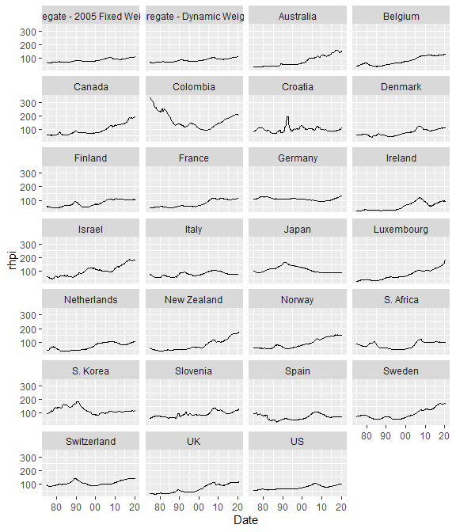

<!-- README.md is generated from README.Rmd. Please edit that file -->

# ihpdr

<!-- badges: start -->

[](https://CRAN.R-project.org/package=ihpdr)
[](https://www.tidyverse.org/lifecycle/#maturing)
[](https://travis-ci.org/kvasilopoulos/ihpdr)
[](https://ci.appveyor.com/project/kvasilopoulos/ihpdr)
[](https://codecov.io/gh/kvasilopoulos/ihpdr?branch=master)
<!-- badges: end -->

The goal of {ihpdr} is to fetch data from the [International House Price
Database](https://www.dallasfed.org/institute/houseprice#tab1), compiled
by the Federal Reserve Bank of Dallas.

## Installation

You can install development version from [GitHub](https://github.com/)
with:

``` r
# install.packages("devtools")
devtools::install_github("kvasilopoulos/ihpdr")
```

## Example

This is a basic example which shows you how to download the data:

``` r

# Raw Data
ihpdr::ihpd_get()
#> # A tibble: 4,248 x 6
#>    Date       country     hpi  rhpi   pdi  rpdi
#>    <date>     <chr>     <dbl> <dbl> <dbl> <dbl>
#>  1 1975-01-01 Australia  7.60  39.2  14.1  72.2
#>  2 1975-04-01 Australia  7.74  38.5  14.4  71.4
#>  3 1975-07-01 Australia  8.04  38.6  14.7  70.6
#>  4 1975-10-01 Australia  8.29  37.7  15.2  69.6
#>  5 1976-01-01 Australia  8.58  37.9  15.5  69.1
#>  6 1976-04-01 Australia  8.83  38.1  15.9  69.5
#>  7 1976-07-01 Australia  9.07  38.3  17.1  71.2
#>  8 1976-10-01 Australia  9.25  37.9  17.4  71.1
#>  9 1977-01-01 Australia  9.48  37.9  17.7  70.7
#> 10 1977-04-01 Australia  9.66  37.7  18.0  70.2
#> # ... with 4,238 more rows

# Exuberance Indicators ~ bsadf
ihpdr::ihpd_get("bsadf")
#> # A tibble: 16,284 x 6
#>    Date       country   type    lag value  crit
#>    <date>     <chr>     <chr> <dbl> <dbl> <dbl>
#>  1 1975-01-01 Australia rhpi      1    NA    NA
#>  2 1975-04-01 Australia rhpi      1    NA    NA
#>  3 1975-07-01 Australia rhpi      1    NA    NA
#>  4 1975-10-01 Australia rhpi      1    NA    NA
#>  5 1976-01-01 Australia rhpi      1    NA    NA
#>  6 1976-04-01 Australia rhpi      1    NA    NA
#>  7 1976-07-01 Australia rhpi      1    NA    NA
#>  8 1976-10-01 Australia rhpi      1    NA    NA
#>  9 1977-01-01 Australia rhpi      1    NA    NA
#> 10 1977-04-01 Australia rhpi      1    NA    NA
#> # ... with 16,274 more rows

# Get the release dates
ihpdr::ihpd_release_dates()
#>   Last Quarter Included  Data Release Date
#> 2    First quarter 2019    July 8–12, 2019
#> 3   Second quarter 2019 October 7–11, 2019
#> 4    Third quarter 2019 January 6–10, 2020
#> 5   Fourth quarter 2019   April 6–10, 2020
```

## Wrangle & Plot Real House Prices

``` r
library(tidyverse)
```

### Raw Data

``` r
raw_data <- ihpdr::ihpd_get()

ggplot(raw_data, aes(Date, rhpi)) + 
  geom_line(size = 0.7) + 
  scale_x_date(date_labels = "%y") +
  facet_wrap(~country, ncol = 4) 
```



### Exuberance Indicators - Date-stamping

``` r
bsadf_data <- ihpdr::ihpd_get("bsadf")

bsadf_data %>% 
  dplyr::filter(type == "rhpi", lag == 1) %>% 
  ggplot() + 
  geom_line(aes(Date, value), size = 0.7) +
  geom_line(aes(Date, crit), col = "red", size = 0.7) +
  scale_x_date(date_labels = "%y") +
  facet_wrap(~country, ncol = 4)
```


